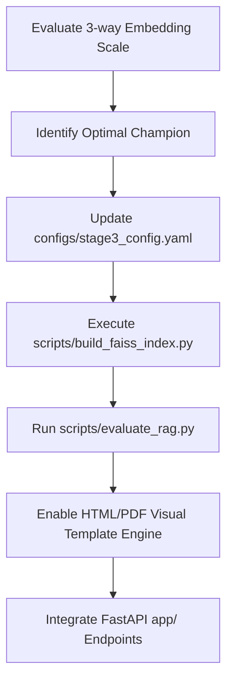

# Legal Contract Risk Analyzer — Technical Code Architecture Reference

This document serves as the primary engineering-side architecture and implementation reference for the **Legal Contract Risk Analyzer**. It captures the end-to-end pipeline topography, data schemas, recent high-impact updates, and downstream production integration roadmaps.

---

## 1. End-to-End Pipeline Topology

The architecture consists of three core sequential stages coupled with a FastAPI service layer and evaluated by a model-sensitive testing harness.

```text
       Contract PDF/Text
              │
              ▼
┌─────────────────────────────┐
│  Stage 1+2: Extract &       │  Single fine-tuned DeBERTa-base model
│  Classify (combined)        │  CUAD dataset, QA format sliding window
│  Output: List[ClauseObject] │  Spans, character offsets & confidences
└─────────────┬───────────────┘
              │
              ▼
┌─────────────────────────────┐
│  Stage 3: Risk Detection    │  HybridPrior Gating & LangGraph ReAct Agent
│  Agent with RAG             │  - Prior Signal: fine-tuned DeBERTa-v3-base (Ens-F)
│  Tools: precedent_search    │  - Verified by: BAAI/bge-small-en-v1.5 FAISS vectors
│         contract_search     │  - LLM Synthesis: Qwen-3-30B via local llama-server
│  Output: List[Assessed]     │  - Smart Routing: Whitelisted complex override gates
└─────────────┬───────────────┘
              │
              ▼
┌─────────────────────────────┐
│  Stage 4: Report Generation │  Progressive Visualization Rendering Pipeline
│  Hybrid Code + LLM synthesis│  - deterministic lookup + LLM Executive Summary
│  Jinja2 Visual Templating   │  - HTML / PDF rendering with premium CSS assets
│  Output: HTML / JSON Report │
└─────────────────────────────┘
```

---

## 2. Deep-Dive Stage Architectures & Recent Updates

### 💡 Stage 1+2: Clause Extraction & Classification
*   **Purpose:** Extract target raw clauses from parsed contract text.
*   **Model:** `microsoft/deberta-base` fine-tuned on the `theatticusproject/cuad-qa` dataset (41 legal categories mapped to structured question templates).
*   **Inference Strategy:** sliding-window tokenizer (`doc_stride=128`, `max_seq_length=512`) to process long-form legal contracts (10k-50k words) while handling extreme class imbalance (~67.9% negative windows).
*   **Output DTO:** [ClauseObject](file:///Users/ts/Desktop/C/AI_ML_Project/ai_ml_project_pipeline/src/common/schema.py) (offset spans, confidence scores, and raw text).

### 🛡️ Stage 3: Risk Detection Agent
*   **Purpose:** Contextually assess extracted clauses using a multi-tool agentic architecture.
*   **Orchestrator:** `LangGraph`.
*   **Recent High-Impact Updates:**
    *   **Unified Soft-Target Cross-Entropy:** Implemented mixed-batch training in `src/stage3_risk_agent/train.py` using PyTorch `CrossEntropyLoss` with probability distributions as targets (combining hard-agreed human votes and soft Gemini/Qwen uncertainty vectors).
    *   **Ens-F Ensemble Prior Classifier:** Under the hood, two fine-tuned `DeBERTa-v3-base` seeds run as an ensemble (`ce-parties` + `corn-parties`) with signing-party text injected into segment A to resolve party-role ambiguity during inference.
    *   **Smart Routing (Vectorless Gating):** Implemented a selective whitelist of highly complex legal categories (such as *Affiliate License*, *IP Assignment*, *Uncapped Liability*). Predictions on these types automatically bypass high-confidence DeBERTa predictions, forcing mandatory LangGraph agent review to sustain F1 accuracy ($0.64+$).
    *   **Advanced Retrieval evaluation standards:** Added model-sensitive **Top-K Label Risk Consistency** (aligning with industry-standard **Ragas** and **TruLens** evaluation benchmarks). Instead of global database stats, we measure how many of the top $K$ ($K=1, 5, 10$) retrieved precedents match *both* the correct category and the correct risk label.
    *   **Embedding Model Evaluation Scale:** Refactored the benchmark suite in [compare_embeddings.py](file:///Users/ts/Desktop/C/AI_ML_Project/ai_ml_project_pipeline/scripts/compare_embeddings.py) to run a 3-way evaluation scale:
        1.  `all-MiniLM-L6-v2` (384d baseline)
        2.  `bge-small-en-v1.5` (384d champion)
        3.  `bge-base-en-v1.5` (768d base model matching DeBERTa's resolution)

### 🎨 Stage 4: Report Generation & Progressive Visualization
*   **Purpose:** Aggregate all risk-assessed clauses and compile a client-ready comprehensive report.
*   **Recent High-Impact Updates:**
    *   **Progressive HTML/PDF Report Rendering Pipeline:** Refactored the static string synthesis. Stage 4 now leverages a custom Jinja2 HTML layout file loaded with elegant pastel typography, distinct border-left risk tags, and detailed markdown tables.
    *   **Executive Summary:** A Qwen-3-30B local API call generates highly descriptive executive summaries, while missing protections are mapped deterministically via Python dictionaries.

---

## 3. Core System Data Contracts

The pipelines are decoupled and communicate strictly through typed Python dataclasses declared in [schema.py](file:///Users/ts/Desktop/C/AI_ML_Project/ai_ml_project_pipeline/src/common/schema.py).

### 📥 Stage 1+2 Output (Stage 3 Input)
```json
{
  "clause_id": "contract_001_Indemnification_0030",
  "document_id": "contract_001",
  "clause_text": "Contractor shall indemnify Company against all claims...",
  "clause_type": "Indemnification",
  "start_pos": 4521,
  "end_pos": 4687,
  "confidence": 0.94
}
```

### 🧠 Stage 3 Output (Stage 4 Input)
```json
{
  "clause_id": "contract_001_Indemnification_0030",
  "document_id": "contract_001",
  "clause_text": "Contractor shall indemnify Company against all claims...",
  "clause_type": "Indemnification",
  "risk_level": "HIGH",
  "risk_explanation": "One-sided indemnification covering counterparty negligence",
  "similar_clauses": [
    {
      "text": "Vendor shall indemnify Client against all negligent acts...",
      "risk_level": "HIGH",
      "similarity": 0.89
    }
  ],
  "cross_references": ["contract_001_Liability_0042"],
  "confidence": 0.88,
  "agent_trace": [
    {"tool": "precedent_search", "result_count": 5},
    {"tool": "contract_search", "result_count": 12}
  ]
}
```

### 🏆 Stage 4 Final Structured Output
```json
{
  "document_id": "contract_001",
  "summary": "This vendor agreement contains 23 clauses...",
  "high_risk": [
    {
      "clause_id": "contract_001_Indemnification_0030",
      "clause_type": "Indemnification",
      "risk_level": "HIGH",
      "explanation": "The indemnification provision requires Contractor to...",
      "recommendation": "Renegotiate to mutual indemnification..."
    }
  ],
  "medium_risk": [],
  "low_risk_summary": "15 clauses were assessed as standard/low risk...",
  "missing_protections": ["Data Protection", "Force Majeure"],
  "overall_risk_score": 6.8,
  "total_clauses": 23,
  "metadata": {
    "generated_at": "2026-05-17T13:50:00Z",
    "models_used": {
      "extraction": "rajnishahuja/cuad-stage1-deberta",
      "risk_classification": "models/stage3_risk_deberta_v3",
      "embeddings": "BAAI/bge-small-en-v1.5",
      "explanation": "Qwen3-30B-Q4_K_XL"
    }
  }
}
```

---

## 4. Current Experimental & Future Plans Roadmap



### 🗺️ Step-by-Step Production Roadmap

#### Phase 1: Embedding Champion Swap & Re-Indexing (Active Phase)
1.  **Run Symmetrical Benchmark**: Execute [compare_embeddings.py](file:///Users/ts/Desktop/C/AI_ML_Project/ai_ml_project_pipeline/scripts/compare_embeddings.py) to gather high-fidelity Precision and Ragas-style Consistency metrics comparing `MiniLM-L6`, `BGE-Small`, and `BGE-Base`.
2.  **Verify the Geometric Accuracy Ceiling**: Analyze whether going from 384d (`bge-small-en-v1.5`) to 768d (`bge-base-en-v1.5`) provides a significant jump in Top-1 and Top-10 Consistency. 
3.  **Perform Defensive Backup**: Before updating active vectors, copy `data/faiss_index/clauses.index` and `data/faiss_index/clauses.json` to `.bak` files.
4.  **Point Config to Champion**: Update `embedding_model` inside `configs/stage3_config.yaml` to point to the winning model (e.g., `BAAI/bge-small-en-v1.5` or `BAAI/bge-base-en-v1.5`).
5.  **Compile Champion Index**: Run `scripts/build_faiss_index.py` to regenerate training vectors.
6.  **Validate RAG Retrieval**: Run `scripts/evaluate_rag.py` to record official test-split retrieval metrics.

#### Phase 2: Visual HTML Rendering Engine Activation
1.  **Activate Jinja2 templating**: Activate the HTML report builder inside `src/stage4_report_gen/report_builder.py`.
2.  **Render Visual Dashboards**: Output premium visual HTML templates with styled CSS styling blocks for direct lawyer/client reviews.

#### Phase 3: High-Coverage Unit Testing
1.  **Implement Mock Testing**: Replace the dead-code `NotImplementedError` stubs inside `tests/` with actual pytest mocks for Stage 1 inference, FAISS query vectors, and the FastAPI service routers.
