# `contract_search` — Architecture & Data Flow

> Stage 3 tool that resolves same-contract cross-references for the Mistral-7B
> reasoning agent. Returns clauses from the SAME contract whose type is
> *legally related* to the target clause's type, per a hand-curated static
> map. Closure-bound at agent runtime so Mistral never carries clause data
> as a tool argument.
>
> Companion to [ARCHITECTURE.md](../ARCHITECTURE.md) §"Stage 3 Architecture
> — Hybrid Confidence-Gated".

---

## Table of contents

1. [Why this tool exists](#why-this-tool-exists)
2. [Two-channel design — tool vs prompt](#two-channel-design)
3. [Function call reference](#function-call-reference)
4. [Activity diagram](#activity-diagram-mermaid)
5. [Sequence diagram](#sequence-diagram-mermaid)
6. [Plain-English walkthrough](#plain-english-walkthrough)
7. [Data sources & resolution paths](#data-sources--resolution-paths)
8. [The static relations map](#the-static-relations-map)
9. [Edge cases & graceful degradation](#edge-cases--graceful-degradation)
10. [Caching & performance](#caching--performance)
11. [ASCII activity diagram (terminal-friendly)](#ascii-activity-diagram)

---

## Why this tool exists

From [ARCHITECTURE.md §"Labeling Review Learnings"](../ARCHITECTURE.md):

> **Cross-Contract Clause Interaction Changes Labels** — Several clauses were
> correctly assessed only after reading *other clauses* in the same contract.
> MR-095 (IP assistance clause): looked HIGH alone, but other clauses showed
> IP already assigned elsewhere — this was just administrative paperwork → LOW.

A clause read in isolation can be misleading. `contract_search` lets Mistral
pull the OTHER clauses in the same contract that legally interact with the
clause it's currently assessing, so it can resolve cross-references at
inference time instead of guessing.

The Stage 3 architecture is **Hybrid Confidence-Gated**:

- DeBERTa risk classifier on every clause → `(label, confidence)`.
- `confidence ≥ 0.6` → fast path, single Mistral call, no tools.
- `confidence < 0.6` → agent path, ReAct loop with `precedent_search` +
  **`contract_search`**. Mistral may override DeBERTa's preliminary label.

`contract_search` is the load-bearing piece on the agent path because
**signing-party ambiguity is the #1 driver of label flips** (81% of HIGH↔LOW
manual-review cases). Once Mistral can see the rest of the contract, it can
infer who's the buyer / vendor / licensor and assess risk from the correct
perspective.

---

## Two-channel design

There are **two distinct flows** that supply Mistral with same-contract context:

| | Channel 1 — `contract_search` tool | Channel 2 — METADATA block in prompt |
|---|---|---|
| **What flows** | Risk-bearing related clauses (Cap On Liability, License Grant, Indemnification, …) | Parties / Effective Date / Expiration Date / Agreement Date / Document Name |
| **How** | Mistral emits a tool call when it decides it needs evidence | Always present in the user prompt — no tool call needed |
| **Why this split** | Related-clause text is bulky and only needed sometimes — pay the tokens on demand | Parties is needed on **turn 1** to resolve signing-party direction; can't gate it behind a tool call |
| **Filtered by** | `clause_type_relations.json` static map | Hard-coded list of 5 metadata clause types |
| **Code path** | `bound_search` → `contract_search` → `_resolve_contract_clauses` + `_allowed_types_for` | `extract_metadata_block(extracted_clauses)` |

> **Why metadata isn't fetched via the tool**: the signing-party direction
> issue must be resolved on the very first reasoning turn. Forcing Mistral
> to spend a tool call on Parties before it can begin reasoning would be
> wasteful and add latency to every uncertain clause. Direct prompt injection
> is cheap (~50–100 tokens), always available, and reproducible.

---

## Function call reference

All paths originate at the LangGraph orchestrator and converge on
`bound_search` when Mistral emits a `contract_search` tool call.

| # | Function | File:line | Input | Output |
|---|---|---|---|---|
| 1 | `node_risk_classifier(state)` | [nodes.py:263](../src/stage3_risk_agent/nodes.py#L263) | `RiskAnalysisState` | `{flagged_clauses, metadata_block}` |
| 2 | `extract_metadata_block(clauses)` | [tools.py:388](../src/stage3_risk_agent/tools.py#L388) | `Iterable[Any]` | `dict[str, str]` (Parties / Dates) |
| 3 | `continue_to_mistral(state)` | [graph.py:14](../src/workflow/graph.py#L14) | `RiskAnalysisState` | `list[Send]` (one per clause) |
| 4 | `node_mistral_router(state)` | [nodes.py:306](../src/stage3_risk_agent/nodes.py#L306) | `RAGWorkerState` (per-branch payload) | `{risk_assessed_clauses: [...]}` |
| 5 | `make_contract_search(extracted_clauses, ...)` | [tools.py:308](../src/stage3_risk_agent/tools.py#L308) | `Iterable[Any]` | `Callable[[str, str], list[dict]]` |
| 6 | `bound_search(document_id, clause_type)` | [tools.py:343](../src/stage3_risk_agent/tools.py#L343) | `(str, str)` | `list[dict]` |
| 7 | `contract_search(document_id, clause_type, *, all_clauses, ...)` | [tools.py:134](../src/stage3_risk_agent/tools.py#L134) | `(str, str, list)` | `list[dict]` |
| 8 | `_resolve_contract_clauses(...)` | [tools.py:232](../src/stage3_risk_agent/tools.py#L232) | `(document_id, all_clauses, ...)` | `list[dict]` (one contract's clauses) |
| 9 | `_coerce_clause(clause)` | [tools.py:112](../src/stage3_risk_agent/tools.py#L112) | `Any` (dataclass / pydantic / dict) | normalized `dict` |
| 10 | `_allowed_types_for(clause_type, relations_path)` | [tools.py:279](../src/stage3_risk_agent/tools.py#L279) | `(str, str)` | `frozenset[str] \| None` |
| 11 | `_load_relations(relations_path)` | [tools.py:54](../src/stage3_risk_agent/tools.py#L54) | `str` | `dict[str, frozenset[str]]` (cached) |
| 12 | `_agent_path(c, ..., bound_contract_search, metadata_block)` | [nodes.py:153](../src/stage3_risk_agent/nodes.py#L153) | clause + closure + metadata | result dict |

### What Mistral actually sees

Despite this whole call chain, Mistral's tool surface is just:

```python
contract_search(document_id: str, clause_type: str) -> list[dict]
```

Two strings in, list of clause dicts out. Everything else is encapsulated
behind the closure produced by `make_contract_search`.

---

## Activity diagram (Mermaid)

```mermaid
flowchart TD
    Start([Stage 3 begins<br/>state.extracted_clauses populated by Stage 1+2]) --> A

    A["node_risk_classifier(state)<br/>📁 nodes.py:263<br/>━━━━━━<br/>Input: RiskAnalysisState<br/>Output: flagged_clauses + metadata_block"]
    A --> B["extract_metadata_block(extracted_clauses)<br/>📁 tools.py:388<br/>━━━━━━<br/>Input: Iterable of clause<br/>Output: dict Parties / Dates"]
    B --> B1["For each clause: _coerce_clause<br/>📁 tools.py:112"]
    B1 --> C["DeBERTa risk_classifier (mocked)<br/>per-clause: label, confidence"]
    C --> D["Return flagged_clauses + metadata_block<br/>↓ written to state"]

    D --> E["continue_to_mistral(state)<br/>📁 graph.py:14<br/>━━━━━━<br/>Input: RiskAnalysisState<br/>Output: list Send — one per clause"]
    E --> F{{"FAN-OUT<br/>One worker branch per clause<br/>Each Send carries:<br/>• clause_data<br/>• extracted_clauses (full list)<br/>• document_id<br/>• metadata_block"}}

    F --> G["node_mistral_router(state)<br/>📁 nodes.py:306<br/>━━━━━━<br/>Input: RAGWorkerState<br/>Runs per clause"]
    G --> H["make_contract_search(extracted_clauses)<br/>📁 tools.py:308<br/>━━━━━━<br/>Input: full clause list<br/>Output: bound_search closure"]
    H --> H1["For each clause: _coerce_clause<br/>📁 tools.py:112<br/>(snapshot to dicts)"]
    H1 --> I{conf >= 0.6 ?}

    I -->|YES — Fast Path| J["_fast_path(clause)<br/>📁 nodes.py:112<br/>1 Mistral call, no tools<br/>contract_search NOT called"]
    I -->|NO — Agent Path| K["_agent_path(<br/>clause, ...,<br/>bound_contract_search,<br/>metadata_block<br/>)<br/>📁 nodes.py:153"]

    K --> K1["Mistral prompt =<br/>system + clause + METADATA block<br/>+ tool definitions"]
    K1 --> L1["Turn 1: precedent_search FAISS<br/>(out of scope this branch)"]
    L1 --> L2["Turn 2: bound_search(doc_id, clause_type)<br/>📁 tools.py:343<br/>━━━━━━<br/>Input from Mistral: 2 strings<br/>NO clause data crosses LLM boundary"]

    L2 --> M["contract_search(<br/>document_id,<br/>clause_type,<br/>all_clauses=bound_clauses<br/>)<br/>📁 tools.py:134"]

    M --> N["_resolve_contract_clauses(...)<br/>📁 tools.py:232<br/>━━━━━━<br/>Filter: c.document_id == doc_id<br/>Filter: c.clause_type ∉ METADATA"]
    N --> N1{empty?}
    N1 -->|yes| Empty["Return [] to Mistral"]
    N1 -->|no| O

    O["_allowed_types_for(<br/>clause_type,<br/>relations_path<br/>)<br/>📁 tools.py:279"]
    O --> O1["_load_relations(relations_path)<br/>📁 tools.py:54<br/>(lru_cache: hit after 1st call)<br/>━━━━━━<br/>Reads clause_type_relations.json"]
    O1 --> O2{type in<br/>relations?}
    O2 -->|no| P_None["Return None →<br/>filter disabled<br/>(graceful degradation)"]
    O2 -->|yes| P["Return frozenset:<br/>relations type ∪ self"]

    P_None --> Q["Skip type filter"]
    P --> R["Filter: c.clause_type ∈ allowed"]
    Q --> R
    R --> S["Return list dict<br/>related clause data"]

    S --> T["bound_search returns to Mistral"]
    T --> U["Mistral reasons over:<br/>• target clause<br/>• METADATA block<br/>• precedent results<br/>• same-doc related clauses"]
    U --> V["Final JSON: label, explanation,<br/>override_reason"]
    V --> W

    J --> W["Build RiskAssessedClause"]
    Empty --> U
    W --> X["Return via operator.add reducer<br/>state.risk_assessed_clauses += c"]
    X --> End([Stage 4 begins])
```



---

## Sequence diagram (Mermaid)

```mermaid
sequenceDiagram
    autonumber
    participant LG as LangGraph<br/>(graph.py)
    participant Disp as node_risk_classifier<br/>(nodes.py:263)
    participant TX as extract_metadata_block<br/>(tools.py:388)
    participant CTM as continue_to_mistral<br/>(graph.py:14)
    participant Wkr as node_mistral_router<br/>(nodes.py:306)
    participant MCS as make_contract_search<br/>(tools.py:308)
    participant AP as _agent_path<br/>(nodes.py:153)
    participant M as Mistral
    participant BS as bound_search<br/>(tools.py:343)
    participant CS as contract_search<br/>(tools.py:134)
    participant Res as _resolve_contract_clauses<br/>(tools.py:232)
    participant AT as _allowed_types_for<br/>(tools.py:279)
    participant LR as _load_relations<br/>(tools.py:54)

    Note over LG,Disp: PHASE 1 — Per-contract setup (runs ONCE)
    LG->>Disp: state {extracted_clauses, document_id}
    activate Disp
    Disp->>TX: extract_metadata_block(extracted_clauses)
    activate TX
    TX-->>Disp: {Parties, Effective Date, ...}
    deactivate TX
    Note right of Disp: DeBERTa classifies each clause<br/>(label, confidence)
    Disp-->>LG: {flagged_clauses, metadata_block}
    deactivate Disp

    LG->>CTM: state (now with metadata_block)
    activate CTM
    CTM-->>LG: list of Send payloads
    deactivate CTM
    Note over LG: Each Send payload =<br/>{clause_data, extracted_clauses,<br/>document_id, metadata_block}

    Note over LG,Wkr: PHASE 2 — FAN-OUT (one branch per clause, parallel)

    LG->>Wkr: state {clause_data: c_i, extracted_clauses, ...}
    activate Wkr

    Wkr->>MCS: make_contract_search(extracted_clauses)
    activate MCS
    Note right of MCS: Snapshot clauses to dicts<br/>via _coerce_clause<br/>(tools.py:112)
    MCS-->>Wkr: bound_search closure
    deactivate MCS

    alt confidence >= 0.6  (Fast Path)
        Wkr->>Wkr: _fast_path(c_i) — no tool calls
    else confidence < 0.6  (Agent Path)

        Wkr->>AP: _agent_path(c_i, ..., bound_search, metadata_block)
        activate AP

        AP->>M: prompt {system + clause + METADATA + tools}
        activate M
        Note over AP,M: Mistral now has Parties, Dates,<br/>and tool definitions

        M-->>AP: tool_call: precedent_search(text, k=5)
        AP->>AP: _mock_precedent_search (FAISS — out of scope)
        AP-->>M: top-K precedent dicts

        M-->>AP: tool_call: contract_search(doc_id, clause_type)
        Note over M,AP: Mistral passes only 2 strings.<br/>NO clause data crosses LLM boundary.

        AP->>BS: bound_search("d1", "Cap On Liability")
        activate BS
        BS->>CS: contract_search(<br/>doc_id, clause_type,<br/>all_clauses=bound_clauses,<br/>relations_path=...)
        activate CS

        CS->>Res: _resolve_contract_clauses(doc_id, all_clauses, ...)
        activate Res
        Note right of Res: Filter by document_id<br/>Drop metadata types
        Res-->>CS: list of dicts (contract clauses)
        deactivate Res

        CS->>AT: _allowed_types_for(clause_type, relations_path)
        activate AT
        AT->>LR: _load_relations(path)
        activate LR
        Note right of LR: lru_cache; reads<br/>clause_type_relations.json<br/>once per process
        LR-->>AT: dict mapping type to frozenset
        deactivate LR
        AT-->>CS: frozenset(related ∪ self) or None
        deactivate AT

        Note right of CS: Filter contract clauses by<br/>type ∈ allowed set
        CS-->>BS: list of dicts (related siblings)
        deactivate CS
        BS-->>AP: result
        deactivate BS

        AP-->>M: tool_result (related clause list)

        M-->>AP: final JSON {label, explanation, override_reason}
        deactivate M

        AP-->>Wkr: {risk_level, risk_reason, agent_trace, ...}
        deactivate AP
    end

    Wkr-->>LG: {risk_assessed_clauses: [c_i_assessed]}
    deactivate Wkr

    Note over LG: operator.add reducer collects<br/>all parallel branch outputs<br/>→ state.risk_assessed_clauses
    Note over LG: → Stage 4 (Node E)
```

---

## Plain-English walkthrough

### PHASE 1 — Per-contract setup (1 run per contract)

1. **LangGraph hands the dispatcher the full state.** `state.extracted_clauses`
   was populated by Stage 1+2 (DeBERTa QA extraction).
2. **Dispatcher calls `extract_metadata_block`** to pull `Parties` /
   `Effective Date` / `Expiration Date` / `Agreement Date` / `Document Name`
   out of `extracted_clauses` into a dict, in canonical order. First
   occurrence wins on duplicates.
3. **DeBERTa classifies each clause** (currently mocked — production drops
   in the fine-tuned classifier).
4. **Dispatcher returns `{flagged_clauses, metadata_block}`** — these merge
   into state.

### Fan-out

5. **`continue_to_mistral` reads state** and produces one `Send` per
   clause. Each Send payload carries the **single clause being assessed**
   plus the **full `extracted_clauses` list**, `document_id`, and
   `metadata_block`. Reference-passing — no deep copy.

### PHASE 2 — Per-clause worker (N parallel runs)

6. **The worker receives a clause-sized state slice** but with full contract
   context.
7. **`make_contract_search(extracted_clauses)` is called once per worker.**
   It snapshots the clauses (via `_coerce_clause`) into a list of dicts and
   returns a `bound_search` closure with `(document_id, clause_type)`
   signature. The closure is independent of caller mutation.
8. **Confidence gate decides Fast vs Agent path.**

### Agent path (when confidence < 0.6)

9. **`_agent_path` builds Mistral's prompt** — clause + METADATA block +
   tool definitions — and invokes Mistral.
10. **Mistral first calls `precedent_search`** (FAISS RAG; out of scope this
    branch). Returns top-K similar clauses with risk labels from the corpus.
11. **Mistral then issues `contract_search(doc_id, clause_type)`** — just
    two strings, no clause data on the LLM tape.
12. **The bound `bound_search` calls `contract_search(...)`** with
    `all_clauses=bound_clauses` (the closure's snapshot).
13. **`contract_search` calls `_resolve_contract_clauses`** to filter the
    snapshot by `document_id` and drop metadata types.
14. **`contract_search` calls `_allowed_types_for(clause_type, ...)`**, which:
    - Calls `_load_relations` (cached after first call) to read
      `clause_type_relations.json`.
    - Returns `relations[clause_type] ∪ {clause_type}` as a frozenset, or
      `None` if the type is unknown.
15. **`contract_search` filters the contract clauses** by the allowed-types
    set and returns the result list.
16. **Mistral receives related clauses**, reasons over `target clause +
    METADATA + precedents + related siblings`, and emits a final JSON label.
17. **The worker packages it into a `RiskAssessedClause`** and returns it
    via `operator.add`.

---

## Data sources & resolution paths

`contract_search` has three resolution paths for the contract data,
tried in priority order:

| Priority | Source | When used | Speed |
|---|---|---|---|
| 1 | **In-memory** (`all_clauses=...`) | Production / agent runtime — clauses bound via `make_contract_search`. | Microseconds (list filter). |
| 2 | **Pre-built index** (`data/processed/contract_clause_index.json`) | Offline eval / standalone scripts where no LangGraph state exists. Built by `scripts/build_contract_clause_index.py`. | ~5 µs cached, ~40 ms cold. |
| 3 | **Raw spans corpus** (`data/processed/all_positive_spans.json`) | Fallback if the index file is missing. Filters the 6,702-row corpus on the fly. | ~50 ms each call. |

In production, only path 1 is hot. Paths 2 and 3 exist for development /
offline workflows.

> Because the LangGraph worker passes `extracted_clauses` from state via the
> Send payload, the worker's `make_contract_search` factory always uses the
> in-memory path. The static index files are NEVER consulted on the
> production hot path.

---

## The static relations map

File: [`data/reference/clause_type_relations.json`](../data/reference/clause_type_relations.json)
(5.4 KB, 41 entries — one per CUAD clause type).

Built by [`scripts/build_clause_type_relations.py`](../scripts/build_clause_type_relations.py)
from a hand-curated Python dict, organized into 6 clusters:

| Cluster | Members |
|---|---|
| **Liability** | Cap On Liability ↔ Uncapped Liability ↔ Liquidated Damages ↔ Insurance ↔ Warranty Duration ↔ Covenant Not To Sue |
| **Term & termination** | Renewal Term ↔ Notice Period To Terminate Renewal ↔ Termination For Convenience ↔ Post-Termination Services ↔ Effective/Expiration Date |
| **IP & licensing** | License Grant (hub, 8 out / 9 in) ↔ Non-Transferable / Irrevocable / Affiliate License variants ↔ IP Ownership ↔ Joint IP ↔ Source Code Escrow |
| **Restrictive covenants** | Non-Compete ↔ Exclusivity ↔ No-Solicit (Customers/Employees) ↔ Competitive Restriction Exception ↔ Most Favored Nation |
| **Commercial terms** | Minimum Commitment ↔ Volume Restriction ↔ Price Restrictions ↔ Revenue/Profit Sharing ↔ Audit Rights |
| **Assignment & control** | Anti-Assignment ↔ Change Of Control ↔ ROFR/ROFO/ROFN ↔ Affiliate License variants |

### Sample entry

```json
{
  "Cap On Liability": [
    "Uncapped Liability",
    "Liquidated Damages",
    "Insurance",
    "Warranty Duration",
    "Covenant Not To Sue"
  ]
}
```

When Mistral calls `contract_search(doc_id, "Cap On Liability")`, the tool
returns the contract's clauses whose type is in
`{Uncapped Liability, Liquidated Damages, Insurance, Warranty Duration,
Covenant Not To Sue, Cap On Liability}` — i.e., related types ∪ self.

To regenerate after editing relations:

```bash
python scripts/build_clause_type_relations.py            # writes the JSON
python scripts/build_clause_type_relations.py --validate-only  # just check
```

---

## Edge cases & graceful degradation

The tool **never raises** during normal operation. Every failure mode degrades
to an empty list or a relaxed filter:

| Condition | Tool behavior | Mistral handles by |
|---|---|---|
| Empty `document_id` | Logs warning, returns `[]` | Falls back to precedent + clause text |
| Unknown `document_id` | Returns `[]` | Same |
| Unknown `clause_type` (not in relations) | Logs debug, **disables type filter**, returns all non-metadata siblings | Mistral works with broader context — slightly more tokens but no failure |
| Relations file missing | Logs warning, **disables type filter** | Same |
| `clause_type=""` or `None` | No type filter applied | Same |
| Index file missing (path 2) | Falls through to path 3 (raw corpus) | Transparent |
| Both index and corpus missing (paths 2 + 3) | Returns `[]` | Mistral falls back to DeBERTa label with low-confidence note |
| Tool result is `[]` | Mistral receives empty array | Reasons without contract context |
| Tool result has 1 clause | Mistral receives 1-item array | Cross-references against single related clause |
| Tool result has N clauses | Mistral receives N-item array | Strongest evidence path |

The full agent-path fallback chain (worst case): `contract_search` returns
`[]`, `precedent_search` returns `[]` → `_agent_path` keeps DeBERTa's
preliminary label and emits a low-confidence warning in `risk_reason`.

---

## Caching & performance

| Cache | Scope | Purpose | Hit rate |
|---|---|---|---|
| `_load_relations` `lru_cache(maxsize=2)` | Process | Reads `clause_type_relations.json` once per process | ~100% after first call |
| `_load_index` `lru_cache(maxsize=2)` | Process | Reads `contract_clause_index.json` once per process | ~100% (when used) |
| `_load_corpus` `lru_cache(maxsize=2)` | Process | Reads `all_positive_spans.json` once per process | ~100% (when used) |
| `bound_clauses` snapshot | Per-worker | One `_coerce_clause` pass over all extracted clauses | New on every worker call (~13 clauses, microseconds) |

### Measured timings

```
contract_search (in-memory mode, ~13 clauses):  ~5 µs per call
contract_search (cold index load):              ~40 ms first call
contract_search (cold corpus load):             ~50 ms first call
extract_metadata_block (5 clauses):             ~10 µs
make_contract_search (snapshot of 13 clauses):  ~30 µs
```

The hot path on the LangGraph workers is dominated by Mistral inference,
not tool execution. `contract_search` is effectively free.

---

## ASCII activity diagram

For terminal viewing or non-Mermaid renderers:

```
┌──────────────────────────────────────────────────────────────────────┐
│ Stage 3 begins  (state.extracted_clauses ready from Stage 1+2)       │
└────────────────────────────┬─────────────────────────────────────────┘
                             │
                             ▼
┌──────────────────────────────────────────────────────────────────────┐
│ node_risk_classifier(state)                          nodes.py:263    │
│ ─ DeBERTa per-clause classification                                  │
│ ─ extract_metadata_block(clauses)                    tools.py:388    │
│      │                                                                │
│      └─► returns {Parties, Effective Date, Expiration Date, ...}    │
│ Returns: {flagged_clauses, metadata_block}                           │
└────────────────────────────┬─────────────────────────────────────────┘
                             │
                             ▼
┌──────────────────────────────────────────────────────────────────────┐
│ continue_to_mistral(state)                            graph.py:14    │
│ ─ Build N Send payloads, one per flagged clause                      │
│ Each Send: {clause_data, extracted_clauses, document_id,             │
│             metadata_block}                                          │
└────────────────────────────┬─────────────────────────────────────────┘
                             │  FAN-OUT
                ┌────────────┼────────────┐
                ▼            ▼            ▼
   ┌─────────────────┐ ... (N parallel branches) ...
   │ node_mistral_   │
   │ router(state)   │   nodes.py:306
   │                 │
   │ make_contract_  │   tools.py:308
   │ search(         │   ─► snapshot via _coerce_clause × N
   │   extracted_    │   ─► returns bound_search closure
   │   clauses)      │
   │                 │
   │ if conf>=0.6:   │
   │   _fast_path    │   nodes.py:112  (no contract_search call)
   │ else:           │
   │   _agent_path   │   nodes.py:153
   └────────┬────────┘
            │ AGENT PATH
            ▼
   ┌────────────────────────────────────────────────────────────┐
   │ Mistral (system+clause+METADATA block+tool defs)           │
   │   Turn 1 → precedent_search(clause_text, k=5) [FAISS]      │
   │   Turn 2 → contract_search(document_id, clause_type)       │
   │              ↓                                              │
   │   bound_search(doc_id, clause_type)            tools.py:343 │
   │              ↓                                              │
   │   contract_search(doc_id, clause_type,         tools.py:134 │
   │                   all_clauses=bound_clauses)               │
   │              ↓                                              │
   │   ┌──────────────────────────────────────────────┐         │
   │   │ _resolve_contract_clauses(...)  tools.py:232 │         │
   │   │ ─ filter by document_id                       │         │
   │   │ ─ drop metadata types                         │         │
   │   └──────────────────────┬───────────────────────┘         │
   │                          ▼                                  │
   │   ┌──────────────────────────────────────────────┐         │
   │   │ _allowed_types_for(...)         tools.py:279 │         │
   │   │ ─ _load_relations(path)         tools.py:54  │         │
   │   │   (lru_cache; reads clause_type_relations.json)│       │
   │   │ ─ returns frozenset(relations[type] ∪ {type}) │        │
   │   └──────────────────────┬───────────────────────┘         │
   │                          ▼                                  │
   │   filter contract_clauses by  c.clause_type ∈ allowed      │
   │              ↓                                              │
   │   list[dict] of related clauses → returned to Mistral      │
   │              ↓                                              │
   │   Mistral emits final JSON {label, explanation, override}  │
   └────────────────────────────────────────────────────────────┘
            │
            ▼
   ┌─────────────────┐
   │ RiskAssessed    │
   │ Clause built    │
   │ Returned via    │
   │ operator.add    │
   └────────┬────────┘
            │  FAN-IN
            ▼
   state.risk_assessed_clauses → Stage 4 (node_report_generation)
```

---

## Related documentation

- [ARCHITECTURE.md §"Stage 3 Architecture — Hybrid Confidence-Gated"](../ARCHITECTURE.md)
  — high-level decision rationale, why this architecture over alternatives.
- [ARCHITECTURE.md §"Labeling Review Learnings"](../ARCHITECTURE.md)
  — the label-flip patterns that motivated `contract_search` (signing-party
  ambiguity, cross-clause interactions, mutual vs one-sided signals).
- [`scripts/build_clause_type_relations.py`](../scripts/build_clause_type_relations.py)
  — generator + curation rationale for the relations map.
- [`scripts/build_contract_clause_index.py`](../scripts/build_contract_clause_index.py)
  — generator for the offline pre-built clause index.
